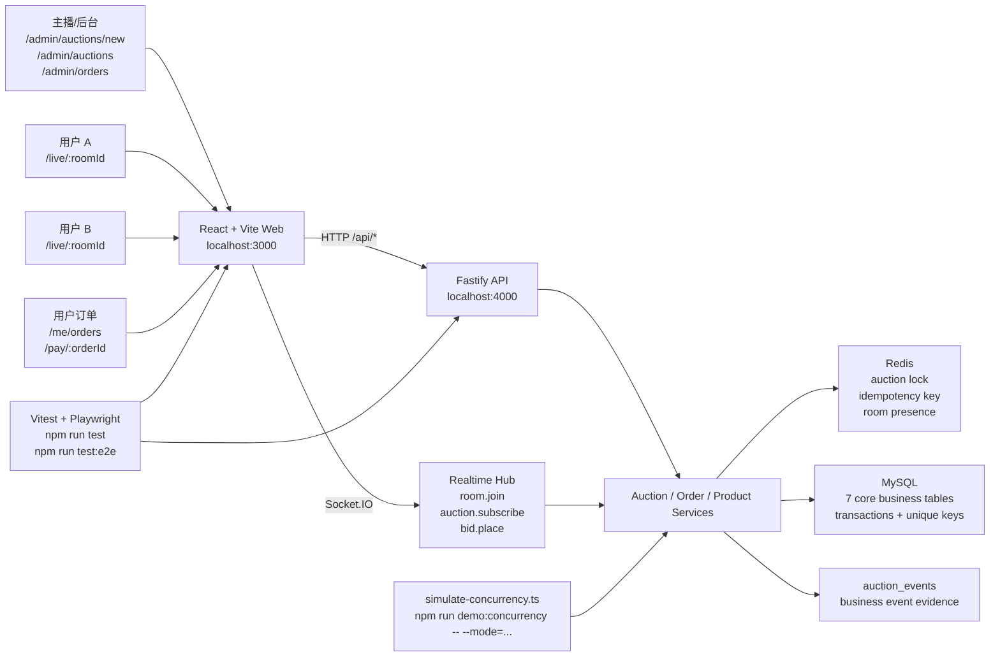
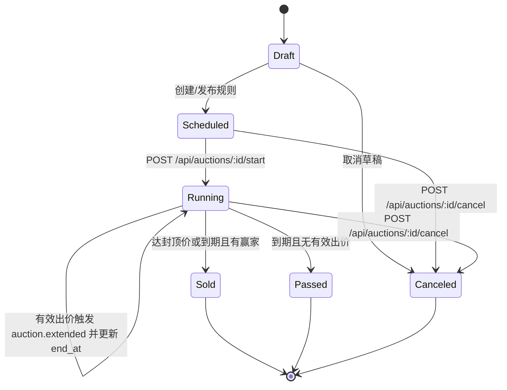
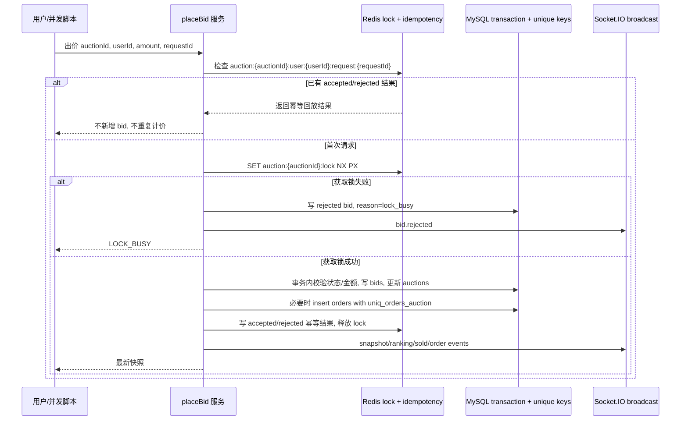

# 2026-06-10 节点 4 技术答辩说明

本文用于答辩时解释当前冻结版本。所有能力描述以现有代码、脚本和文档为边界；未实现的真实直播流、真实支付、复杂鉴权、复杂看板和大规模压测不作为已完成能力陈述。

## 1. 2 分钟架构说明



一句话解释：

前端负责管理端、直播间、订单和模拟支付页面；Fastify 提供 HTTP 主链路；Socket.IO 负责房间级实时同步；Redis 负责短期锁、幂等和在线状态；MySQL 负责最终事实、事务和唯一约束；并发脚本直接复用业务服务，验证一致性不是另写一套假逻辑。

排行榜/最近出价由服务端基于 MySQL `bids` 数据生成，并通过 `ranking.updated` 广播。

## 2. 冻结版本能力边界

已完成并可验收：

- 后台页面发布竞拍：`/admin/auctions/new`。
- 后台列表查看和启动竞拍：`/admin/auctions`。
- 用户直播间出价和实时同步：`/live/:roomId`。
- 成交后订单生成和模拟支付：`/pay/:orderId`。
- 后台订单列表：`/admin/orders`。
- 用户订单和出价历史：`/me/orders`。
- WebSocket 房间隔离、重连后重新获取快照。
- Redis 锁、Redis 幂等 key、MySQL 唯一约束共同保护并发出价和订单唯一性。
- 四种并发脚本模式：
  - `npm run demo:concurrency -- --mode=unique`
  - `npm run demo:concurrency -- --mode=duplicate-accepted`
  - `npm run demo:concurrency -- --mode=duplicate-rejected`
  - `npm run demo:concurrency -- --mode=lock-busy`

不作为已完成能力：

- 真实直播推流。
- 真实支付。
- 完整登录鉴权和多角色权限系统。
- 千级或线上真实压测。
- 独立 `/admin/auctions/:id` 详情页。
- 管理端页面取消按钮。取消能力通过 `POST /api/auctions/:id/cancel`、MySQL 状态和 `auction.canceled` 事件验收。

## 3. 状态机

当前共享状态枚举为 `Draft`、`Scheduled`、`Running`、`Sold`、`Passed`、`Canceled`。自动延时不是独立状态，而是在 `Running` 中刷新 `end_at` 并广播 `auction.extended`。



关键答辩点：

- 只有 `Running` 接收有效出价。
- `Sold`、`Passed`、`Canceled` 是终态，终态不再接收出价，也不能再取消。
- 达到封顶价会直接成交，优先于继续延时。
- 到期结算由快照/订单查询等服务路径触发 `settleDueRunningAuctions` 或单个快照结算，最终事实落在 MySQL。

## 4. 数据库 7 表职责

| 表 | 职责 | 关键字段 | 关键约束/验收点 |
|---|---|---|---|
| `users` | 演示主播和竞拍用户 | `demo_key`、`nickname`、`role` | `demo_key` 唯一；seed 创建 `demo_streamer`、`demo_user_1/2/3` |
| `products` | 商品基础信息 | `title`、`image_url`、`description`、`created_by` | `created_by` 外键到 `users` |
| `auction_rooms` | 固定视频直播间 | `demo_key`、`title`、`video_url`、`status` | `demo_key` 唯一；默认 `demo_room_main` |
| `auctions` | 竞拍规则、价格、状态机 | `room_id`、`product_id`、`start_price`、`increment_step`、`ceiling_price`、`end_at`、`status`、`current_price`、`current_winner_id`、`version` | 状态枚举；价格和时间 `CHECK`；房间/商品/赢家外键 |
| `bids` | 出价记录和拒绝记录 | `auction_id`、`user_id`、`amount`、`request_id`、`accepted`、`reject_reason` | `UNIQUE KEY uniq_bids_request (auction_id, user_id, request_id)` 防重复请求重复落 bid |
| `orders` | 成交订单和模拟支付状态 | `auction_id`、`product_id`、`buyer_id`、`amount`、`status` | `UNIQUE KEY uniq_orders_auction (auction_id)` 防同一竞拍重复生成订单 |
| `auction_events` | 事件证据和答辩追踪 | `auction_id`、`event_type`、`payload_json`、`created_at` | 可查 `auction.created`、`auction.started`、`bid.accepted`、`bid.rejected`、`auction.extended`、`auction.sold`、`order.created`、`auction.canceled`、`order.paid` |

SQL 证据口径：

```sql
SELECT
  a.id,
  a.status,
  a.current_price,
  a.current_winner_id,
  COUNT(DISTINCT o.id) AS order_count,
  SUM(CASE WHEN b.accepted THEN 1 ELSE 0 END) AS accepted_bids,
  SUM(CASE WHEN NOT b.accepted THEN 1 ELSE 0 END) AS rejected_bids,
  SUM(CASE WHEN b.reject_reason = 'lock_busy' THEN 1 ELSE 0 END) AS lock_busy_bids
FROM auctions a
LEFT JOIN orders o ON o.auction_id = a.id
LEFT JOIN bids b ON b.auction_id = a.id
WHERE a.id = <auctionId>
GROUP BY a.id, a.status, a.current_price, a.current_winner_id;
```

```sql
SELECT event_type, COUNT(*) AS event_count
FROM auction_events
WHERE auction_id = <auctionId>
GROUP BY event_type
ORDER BY event_type;
```

## 5. WebSocket 房间隔离和重连

事件协议索引：`docs/websocket_event_protocol.md`。

客户端事件：

- `room.join`：加入直播间，payload 为 `{ roomId, userId }`。
- `room.leave`：离开直播间。
- `auction.subscribe`：订阅某个竞拍。
- `bid.place`：Socket.IO 出价事件，服务端不信任客户端随意传入的 `userId`，以已经 join 的 socket 用户为准。

服务端事件：

- `auction.snapshot`
- `bid.accepted`
- `bid.rejected`
- `ranking.updated`
- `auction.extended`
- `auction.sold`
- `auction.passed`
- `auction.canceled`
- `order.paid`
- `user.outbid`
- `room.presence`

房间隔离规则：

- `room.join` 必须先校验有效 room 和 bidder 用户。
- `auction.subscribe` 必须在成功 `room.join` 之后。
- `auction.subscribe` 会校验 `auction.roomId === socket.roomId`。
- `bid.place` 在调用共享出价服务前也会校验同一 room，避免跨直播间串消息或跨房间出价。

重连规则：

1. 前端保持最近一次 HTTP/WebSocket snapshot。
2. Socket 重连后重新执行 `room.join`。
3. 再执行 `auction.subscribe`。
4. 服务端发送新的 `auction.snapshot`。

边界说明：

- 当前节点不做断线期间事件回放。
- 权威恢复点是 MySQL 支撑的最新快照，而不是客户端缓存。

## 6. 三层并发一致性



三层职责：

| 层 | 防什么 | 具体机制 | 验收方式 |
|---|---|---|---|
| Redis lock | 多用户同时抢同一口价导致价格多次上涨 | `auction:{auctionId}:lock`，`SET NX PX`，Lua token 校验释放 | `unique` 和 `lock-busy` 模式输出、`lockBusyBidRows` |
| Redis 幂等 key | 同一用户同一 `requestId` 重复提交 | `auction:{auctionId}:user:{userId}:request:{requestId}` 记录 `processing`、`accepted:{bidId}`、`rejected:{bidId}:{reason}` | `duplicate-accepted`、`duplicate-rejected` 模式 |
| MySQL 事务和唯一约束 | Redis 或应用层异常时重复落库/重复成交 | `uniq_bids_request`、`uniq_orders_auction`、事务内状态推进 | `orderCount=1`，SQL 查询订单和 bid/event 行数 |

为什么不会重复成交：

- 业务服务只在合法状态推进到 `Sold` 时创建订单。
- `orders` 表有 `UNIQUE KEY uniq_orders_auction (auction_id)`，同一竞拍最多一个订单。
- 并发脚本和 SQL 证据要求 `orderCount=1`。

为什么不会重复支付：

- 模拟支付更新同一 `orders.id` 的 `status`。
- 已支付订单再次进入支付页时按钮显示 `已支付`，不会创建新订单。
- `order.paid` 是订单状态更新后的广播事件，不替代订单表事实。

为什么不会跨房间串消息：

- Socket 必须先 `room.join`。
- 订阅和出价都校验 auction 所属 room 与 socket room 一致。
- 广播按 room/auction 维度发出，重连后以 snapshot 恢复。

## 7. 测试和演示证据

基础命令：

```bash
npm run check:env
npm run redis:ping
npm run db:mysql:ping
npm run test
npm run build
npm run test:e2e
```

并发命令：

```bash
npm run demo:concurrency -- --mode=unique
npm run demo:concurrency -- --mode=duplicate-accepted
npm run demo:concurrency -- --mode=duplicate-rejected
npm run demo:concurrency -- --mode=lock-busy
```

覆盖重点：

- `npm run test`：HTTP 主链路、拒绝出价、重复请求、自动延时、终态结算、WebSocket 隔离、Redis 幂等。
- `npm run test:e2e`：两个页面通过实时事件同步，并走到成交和支付。
- 并发脚本：四种模式输出和 MySQL 行数一致。

## 8. 常见问答

| 问题 | 答法 |
|---|---|
| 为什么不用真实直播流？ | 课题主链路是直播电商竞拍，当前阶段用固定视频模拟直播间，把时间放在竞拍规则、实时同步、订单和并发一致性上。真实直播推流属于明确非 P0 范围。 |
| 为什么 WebSocket 之外还要 HTTP snapshot？ | 实时事件负责低延迟同步，HTTP snapshot 负责重连和兜底恢复。断线期间不做事件回放，恢复时以 MySQL 最新状态为准。 |
| Redis 和 MySQL 谁是最终事实？ | Redis 负责短期并发控制和实时状态辅助，MySQL 是最终事实。订单唯一性和 bid request 唯一性由 MySQL unique key 兜底。 |
| 如果 Redis lock 失败怎么办？ | 请求会按 `LOCK_BUSY` 拒绝，写入 rejected bid 和 `bid.rejected` 事件；`lock-busy` 模式专门验证这个路径。 |
| 为什么重复请求不会重复涨价？ | 同一 `auctionId + userId + requestId` 会命中 Redis 幂等 key，MySQL 还有 `uniq_bids_request`。重复 accepted/rejected 都只复用第一次结果。 |
| 为什么同一竞拍不会生成多个订单？ | 业务服务只在结算路径创建订单，`orders` 表还有 `uniq_orders_auction`。并发 `unique` 模式要求 `orderCount=1`。 |
| 自动延时是不是一个状态？ | 不是。当前状态枚举没有 `Extended`，延时是在 `Running` 状态中更新 `end_at` 并广播 `auction.extended`。 |
| 取消竞拍怎么验证？ | API 为 `POST /api/auctions/:id/cancel`，合法状态是 `Scheduled` 或 `Running`，结果是状态变为 `Canceled` 并广播 `auction.canceled`。当前没有后台取消按钮，所以演示中用 API/SQL/事件验证。 |
| 支付是真支付吗？ | 不是。`/pay/:orderId` 是模拟支付，只更新本地订单状态为 `paid` 并广播 `order.paid`。 |
| AI 如何参与，人工如何把控？ | AI 可用于需求拆解、代码和测试草稿、文档整理；所有结论必须落到 spec、源码、测试和命令证据。人工把控体现在范围冻结、密钥不入库、最终录屏/提交/审批结论确认，不把未发生的人工作业写成已完成。 |

## 9. 答辩底线

- 不说“已接真实直播流”。
- 不说“已接真实支付”。
- 不说“已完成复杂鉴权或线上压测”。
- 不用旧截图替代失败的最终验收；如果命令失败，必须说明环境问题、测试问题还是业务回归。
- 文档、演示和代码命名保持一致：`/admin/auctions/new`、`/live/:roomId`、`/pay/:orderId`、`/admin/orders`、`/me/orders`、`npm run demo:concurrency -- --mode=...`。
