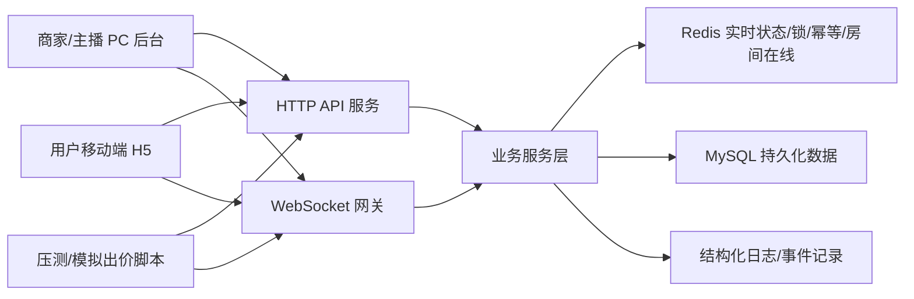
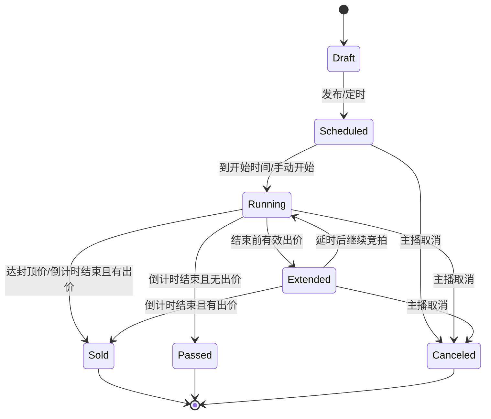

# 抖音电商直播竞拍系统 - 需求与架构规划

整理依据：

- `/Users/haolin6/Downloads/【一组】AI全栈挑战赛：短视频时代交易新玩法：抖音电商直播竞拍全栈系统设计的视频会议.txt`
- `/Users/haolin6/Downloads/🏄_♀️字节跳动全栈挑战赛课题讲解-🛍️抖音电商赛区.txt`
- `/Users/haolin6/Downloads/🛍️抖音电商AI全栈课题-直播竞拍全栈系统（宣讲版）.md`
- `docs/live_auction_project_brief.md`

## 1. 任务理解

本项目要做的是一个直播电商场景下的实时竞拍全栈系统。它不是单纯做一个前端页面，也不是单纯做一个拍卖接口，而是要展示从商品发布、竞拍规则配置、实时出价、排名同步、竞拍成交、订单生成到演示材料沉淀的完整工程闭环。

导师会议里的关键判断：

- 第一优先级是完整闭环，不是把每个方向都做到很深。
- 直播流不是核心能力，可以用固定视频模拟直播背景。
- 当前团队背景偏前端，C 端直播间的 1:1 还原、动画氛围、移动端体验会很容易形成评委记忆点。
- 高并发能力不一定要真实跑到极限硬件指标，但要有清楚的代码设计、压测脚本或演示入口，能讲明白瓶颈和扩展方案。
- AI 贡献率不是越高越好，重点是展示如何用 AI 做需求拆解、方案设计、编码、审查、调试和文档沉淀。
- 可观测性的底线是能追踪问题、能看日志；可视化链路追踪属于加分。
- 数据治理、接口网关、鉴权、防攻击等可以作为亮点，但不是基础必做项。

截至 2026-05-28，距离 2026-06-10 开发截止还有 13 天；如果把今天也计入可用开发时间，则还有 14 个自然日。策略上应采用“先闭环，再打磨一个亮点”的路径。

## 2. 产品角色

### 商家/主播

使用 PC 管理后台完成竞拍商品和规则管理。

核心诉求：

- 快速发布竞拍商品。
- 配置竞拍规则。
- 查看竞拍进度与结果。
- 异常时能够取消竞拍。
- 成交后能看到订单。

### 用户/观众

使用移动端 H5 进入直播间参与竞拍。

核心诉求：

- 像在直播间一样浏览竞拍商品。
- 清楚看到当前价、倒计时、加价规则和参与人数。
- 能手动出价。
- 能实时知道自己是否领先、是否被超越、是否成交。
- 能查看竞拍结果和历史记录。

### 评委/导师

通过代码、文档、演示视频和答辩判断项目质量。

核心关注：

- 主链路是否顺畅闭环。
- 竞拍规则是否严谨。
- 实时同步是否稳定。
- 前端体验是否像真实抖音场景。
- 高并发与一致性设计是否讲得通。
- AI 使用过程是否可追溯。

## 3. 需求优先级

### P0：必须完成

P0 是演示时不能缺的主链路。

1. 商家端商品发布
   - 商品名称、图片、介绍。
   - 起拍价、加价幅度、竞拍时长、封顶价、自动延时时长。

2. 商家端商品管理
   - 查看商品列表。
   - 查看竞拍状态：未开始、竞拍中、已成交、已取消、已流拍。
   - 修改未开始竞拍的规则。
   - 取消异常竞拍。

3. 用户端直播间
   - 使用固定视频或本地素材模拟直播画面。
   - 展示当前竞拍商品、规则、当前价、倒计时、参与人数。
   - 移动端优先，PC 可作为调试兼容。

4. 用户端出价
   - 手动出价。
   - 出价必须满足固定加价幅度。
   - 低于当前价或重复请求要被拒绝。
   - 成功出价后实时广播当前价、领先者、排行榜、剩余时间。

5. 竞拍规则
   - 达到封顶价自动成交。
   - 结束前出价触发自动延时。
   - 到点后自动结束，最高出价者成交。
   - 无有效出价则流拍。
   - 主播取消后所有用户收到取消通知。

6. 成交与订单
   - 竞拍成交后自动生成订单。
   - 商家端能查看订单。
   - 用户端能查看成交结果和模拟支付页。

7. 实时通信
   - WebSocket 房间隔离。
   - 用户进入直播间订阅对应竞拍房间。
   - 断线重连后可重新拉取当前竞拍快照。

8. 基础材料
   - README 或方案文档。
   - 演示视频脚本。
   - AI 使用记录。

### P1：强烈建议完成

P1 是拉开差距、但不应阻塞 P0 的内容。

1. 竞价氛围体验
   - 领先、被超越、延时、成交的动效反馈。
   - 倒计时最后 10 秒强化视觉紧张感。
   - 实时排行榜动画。
   - 出价按钮防抖和操作反馈。

2. 高并发证明
   - 提供模拟 100 个用户同时出价的脚本或后台按钮。
   - 输出成功数、拒绝数、最终价格、最高出价者、耗时。
   - 验证重复请求不会重复计入。
   - 验证排行榜和最终成交结果一致。

3. 出价幂等
   - 前端每次出价生成 `bidRequestId`。
   - 后端按用户、竞拍、请求 ID 去重。
   - Redis 保存短期幂等记录。

4. 可观测性
   - 后端结构化日志。
   - 竞拍事件日志：开始、出价、延时、成交、取消、异常拒绝。
   - 管理端简单监控卡片：在线人数、出价次数、延时次数、异常次数。

5. AI 使用沉淀
   - 记录 AI 如何参与需求分析、架构设计、代码生成、测试、修复。
   - 记录人工决策点：技术选型、并发策略、状态机、关键代码审查。

### P2：可选加分

P2 只在 P0/P1 稳定后做。

1. 多直播间并发隔离
   - 同时创建多个直播间。
   - 每个直播间独立在线人数、竞拍状态、WebSocket 广播。

2. 更完整的数据治理
   - 观看人数、观看时长、出价转化、成交率。
   - 商家端数据看板。

3. 接口网关能力
   - 简单登录态和角色鉴权。
   - API 限流。
   - WebSocket 连接鉴权。

4. 真实直播链路
   - SRS/ZLMediaKit/MediaMTX 或云直播。
   - HLS/HTTP-FLV 播放。

5. 更强压测
   - 1000 在线连接模拟。
   - 多房间并发压测报告。

## 4. 明确不优先做

为了保证 2026-06-10 前交付，以下内容不放入第一阶段主线：

- 真实支付。
- 物流发货。
- 完整 IM 聊天。
- 真实直播推流。
- 云端部署强绑定。
- 复杂营销玩法。
- 多商户 SaaS 权限体系。
- 全链路可视化追踪平台。
- 千万级真实性能压测。

这些内容可以在答辩中作为扩展设计讲，但不应抢 P0 主链路时间。

## 5. 推荐技术架构

当前项目本地环境已经具备 Node.js、MySQL、Redis。为了速度和前后端统一，建议第一版采用 TypeScript 全栈。

### 总体架构



### 前端

建议：

- React + TypeScript + Vite。
- 移动端 H5 和 PC 管理后台放在同一个前端应用中，用路由区分。
- 状态管理优先用 Zustand 或 Redux Toolkit；如果团队熟 Redux，可按任务书提到的 Redux。
- WebSocket 客户端封装独立模块，统一处理连接、重连、订阅、消息序号。

页面建议：

- `/admin/auctions`：竞拍商品列表。
- `/admin/auctions/new`：发布竞拍。
- `/admin/auctions/:id`：竞拍监控与取消。
- `/admin/orders`：订单列表。
- `/live/:roomId`：用户直播间。
- `/me/orders`：我的竞拍/订单历史。
- `/pay/:orderId`：模拟支付页。

前端关键组件：

- `LiveVideoMock`：固定视频直播背景。
- `AuctionPanel`：当前商品、价格、规则、出价按钮。
- `CountdownTimer`：本地倒计时显示，服务端时间校准。
- `BidRankList`：实时排行榜。
- `BidToast`：领先、被超越、延时、成交提醒。
- `AdminAuctionTable`：后台表格。

### 后端

建议：

- Node.js + TypeScript。
- HTTP：Fastify 或 NestJS。
- WebSocket：Socket.IO 或 `ws`。如果追求开发速度，Socket.IO 的房间和重连机制更省时间；如果追求底层展示，`ws` 更轻。
- MySQL：持久化商品、竞拍、出价记录、订单、事件日志。
- Redis：实时竞拍状态、分布式锁、幂等、房间在线人数、排行榜缓存。

推荐分层：

```text
apps/
  web/              前端
  api/              HTTP + WebSocket 后端
packages/
  shared/           共享类型、状态枚举、事件协议
infra/
  mysql/
docs/
scripts/
```

后端模块：

- `auth`：演示用用户身份和角色。
- `products`：商品基础信息。
- `auctions`：竞拍发布、规则、状态机。
- `bids`：出价校验、并发控制、排行榜。
- `orders`：成交订单。
- `rooms`：直播间和 WebSocket 房间。
- `metrics`：事件日志和演示数据看板。
- `loadtest`：模拟并发出价接口或脚本。

## 6. 数据模型

### MySQL 表

核心表：

- `users`
  - `id`
  - `nickname`
  - `role`

- `products`
  - `id`
  - `title`
  - `image_url`
  - `description`
  - `created_by`

- `auction_rooms`
  - `id`
  - `title`
  - `video_url`
  - `status`

- `auctions`
  - `id`
  - `room_id`
  - `product_id`
  - `start_price`
  - `increment_step`
  - `ceiling_price`
  - `start_at`
  - `end_at`
  - `extend_threshold_sec`
  - `extend_duration_sec`
  - `status`
  - `current_price`
  - `current_winner_id`
  - `version`

- `bids`
  - `id`
  - `auction_id`
  - `user_id`
  - `amount`
  - `request_id`
  - `accepted`
  - `reject_reason`
  - `created_at`

- `orders`
  - `id`
  - `auction_id`
  - `product_id`
  - `buyer_id`
  - `amount`
  - `status`
  - `created_at`

- `auction_events`
  - `id`
  - `auction_id`
  - `event_type`
  - `payload_json`
  - `created_at`

### Redis Key

建议：

- `auction:{id}:state`
  - 当前价格、领先用户、状态、结束时间、版本号。

- `auction:{id}:lock`
  - 出价互斥锁。

- `auction:{id}:bids`
  - 排行榜，可用 Sorted Set，score 为出价金额或金额 + 时间权重。

- `auction:{id}:request:{requestId}`
  - 幂等 key，短 TTL。

- `room:{roomId}:online`
  - 在线用户集合。

- `room:{roomId}:connections`
  - 连接信息，可选。

## 7. 竞拍状态机



关键规则：

- 只有 `Running` / `Extended` 可以接收出价。
- `Draft` / `Scheduled` 可以修改规则。
- `Sold` / `Passed` / `Canceled` 是终态，不允许再出价。
- 达封顶价直接 `Sold`。
- 临近结束时有效出价触发延时。
- 取消操作优先级高于普通出价。

## 8. 出价链路设计

### 正常出价流程

1. 用户点击出价，前端生成 `requestId`。
2. 前端通过 HTTP 或 WebSocket 发送出价请求。
3. 后端校验登录态、用户身份、竞拍状态。
4. 后端检查幂等 key。
5. 后端获取 Redis 锁或执行 Redis Lua 原子脚本。
6. 校验金额是否满足当前价 + 加价幅度。
7. 更新 Redis 当前状态与排行榜。
8. 异步或同步写入 MySQL 出价记录。
9. 判断是否触发延时或封顶成交。
10. 广播 `auction.snapshot` / `bid.accepted` / `ranking.updated`。
11. 前端更新 UI 和动效。

### 并发一致性建议

第一阶段可用 Redis 锁实现：

- 锁粒度：`auction:{id}:lock`
- 锁 TTL：2-3 秒。
- 锁内完成状态读取、金额校验、状态更新、幂等记录。
- 锁释放必须在 finally 中执行。

更强方案可作为答辩亮点：

- Redis Lua 脚本一次性完成幂等检查、金额校验、状态推进。
- MySQL 用 `version` 做乐观锁兜底。
- 异步事件落库失败时保留补偿队列。

## 9. WebSocket 事件协议

客户端发送：

- `room.join`
  - `roomId`
  - `userId`

- `room.leave`
  - `roomId`

- `auction.subscribe`
  - `auctionId`

- `bid.place`
  - `auctionId`
  - `amount`
  - `requestId`

服务端广播：

- `auction.snapshot`
  - 当前状态全量快照。

- `bid.accepted`
  - 出价成功。

- `bid.rejected`
  - 出价失败和原因。

- `ranking.updated`
  - 排行榜变化。

- `auction.extended`
  - 触发延时。

- `auction.sold`
  - 成交。

- `auction.passed`
  - 流拍。

- `auction.canceled`
  - 取消。

- `user.outbid`
  - 用户被超越。

可靠性建议：

- 所有服务端事件带 `serverSeq` 和 `serverTime`。
- 客户端重连后先请求最新快照，不依赖断线期间事件补齐。
- 倒计时以服务端 `endAt` 为准，前端只做展示倒计时。

## 10. API 设计

### 管理端 API

- `POST /api/products`
- `GET /api/products`
- `POST /api/auctions`
- `GET /api/auctions`
- `GET /api/auctions/:id`
- `PATCH /api/auctions/:id`
- `POST /api/auctions/:id/start`
- `POST /api/auctions/:id/cancel`
- `GET /api/orders`

### 用户端 API

- `GET /api/rooms/:roomId`
- `GET /api/rooms/:roomId/auctions`
- `GET /api/auctions/:id/snapshot`
- `POST /api/auctions/:id/bids`
- `GET /api/me/bids`
- `GET /api/me/orders`
- `POST /api/orders/:id/mock-pay`

### 演示/压测 API

- `POST /api/dev/seed`
- `POST /api/dev/loadtest/auction/:id`
- `GET /api/dev/loadtest/:runId`

这些接口只在本地或演示环境开放。

## 11. 推荐亮点选择

基于会议信息，建议主亮点选：

### 主亮点：抖音直播竞拍体验还原 + 稳定竞拍闭环

理由：

- 导师明确提到前端 1:1 还原容易形成优势。
- 团队评委背景偏前端，移动端直播间体验很重要。
- 固定视频模拟直播是被明确认可的取舍。
- 在 P0 闭环之上叠加动画、提醒、排行榜，投入产出比高。

### 技术支撑亮点：100 人并发出价模拟 + 幂等一致性

不追求真实千级压测，而是做一个可演示、可解释的稳定并发证明：

- 一键模拟 100 人出价。
- 展示最终价格和订单唯一性。
- 展示重复请求被去重。
- 展示 Redis 锁/幂等设计图。

### AI 过程亮点：可追溯项目协作记录

沉淀：

- 需求拆解记录。
- 架构设计记录。
- AI 生成代码后的人工审查清单。
- Bug 修复过程。
- 最终答辩讲稿中说明“AI 做了什么，人把控了什么”。

## 12. 演示路径

推荐 10-15 分钟演示结构：

1. 30 秒：说明业务场景和目标。
2. 2 分钟：商家后台发布竞拍商品和规则。
3. 3 分钟：用户 H5 进入直播间，展示固定视频背景、商品卡、出价、排行榜、倒计时、被超越提醒。
4. 2 分钟：触发自动延时、封顶成交或倒计时成交，展示订单生成。
5. 2 分钟：后台查看竞拍状态、订单、事件日志。
6. 2 分钟：一键模拟 100 人并发出价，展示最终一致性。
7. 2 分钟：讲架构图、Redis/MySQL 分工、状态机、AI 使用过程。

## 13. 交付物清单

必须交付：

- 可运行代码库。
- 前端用户端和管理端。
- 后端 API 和 WebSocket 服务。
- MySQL/Redis 配置说明。
- 演示视频。
- 技术方案文档。

建议补充：

- 架构图。
- 状态机图。
- 数据库表说明。
- WebSocket 事件协议。
- 并发测试脚本和结果。
- AI 使用记录。
- 答辩讲稿。

