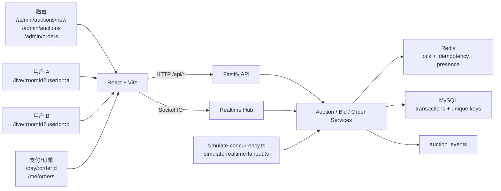
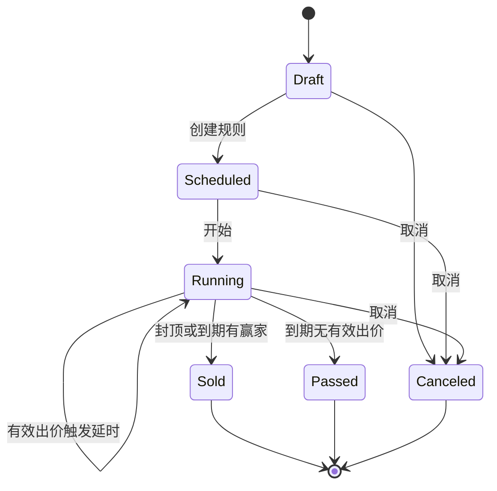

# 技术答辩说明

## 系统架构



前端负责后台、直播间、订单和模拟支付页面；Fastify 提供 HTTP API；Socket.IO 负责房间级实时事件；Redis 负责短期锁、幂等和在线状态；MySQL 是最终事实来源；并发脚本复用业务服务验证一致性。

## 已完成页面和接口

| 模块 | 路径/接口 | 完成状态 |
|---|---|---|
| 后台发布竞拍 | `/admin/auctions/new` | 已完成，含自动延时参数 |
| 后台竞拍列表 | `/admin/auctions` | 已完成，含启动、取消和 Scheduled 编辑入口 |
| 未开始竞拍规则编辑 | `/admin/auctions/:id/edit`、`PATCH /api/auctions/:id` | 2026-06-10 完善完成，只允许 `Scheduled` |
| 用户直播间 | `/live/:roomId`、`/live/:roomId?auctionId=<id>`、`/live/:roomId?userId=<id>`、`/live/:roomId?auctionId=<id>&userId=<id>` | 已完成，演示页面预置 A/B/C 用户，支持常驻用户入口、刷新保留身份、按实际连接数显示在线用户、双端/多端同步、多档出价、`+ / -` 加价器、领先/被超越/倒计时/排名反馈、成交/流拍结果；后端支持更多已存在的 `bidder` 用户参与 |
| 模拟支付 | `/pay/:orderId` | 已完成 |
| 后台订单 | `/admin/orders` | 已完成 |
| 用户订单历史 | `/me/orders` | 已完成 |
| 出价 API | `POST /api/auctions/:id/bids` | 已完成 |
| 取消 API | `POST /api/auctions/:id/cancel` | 已完成 |
| 模拟支付 API | `POST /api/orders/:id/mock-pay` | 已完成 |

## 状态机

状态枚举为 `Draft`、`Scheduled`、`Running`、`Sold`、`Passed`、`Canceled`。自动延时不是独立状态，而是在 `Running` 中更新 `end_at` 并广播 `auction.extended`。



状态规则：

- `Running` 接收有效出价。
- 出价金额可以高于下一口价，但必须按加价幅度对齐；超过封顶价时按封顶价成交。
- 当前领先者可以继续加价，自己加价不会给自己发送 `user.outbid`。
- `Sold`、`Passed`、`Canceled` 是终态。
- 封顶价成交优先于自动延时。
- 到期结算和订单创建落在 MySQL 事务路径中。

## 数据库职责

| 表 | 职责 | 关键约束 |
|---|---|---|
| `users` | 演示主播和竞拍用户 | `demo_key` 唯一 |
| `products` | 商品信息 | `created_by` 外键 |
| `auction_rooms` | 直播间素材和房间状态 | `demo_key` 唯一 |
| `auctions` | 竞拍规则、价格、状态机 | 状态、价格和时间约束 |
| `bids` | 成功/失败出价记录 | `uniq_bids_request` 防重复请求 |
| `orders` | 成交订单和支付状态 | `uniq_orders_auction` 防重复订单 |
| `auction_events` | 业务事件证据 | 记录创建、开始、出价、延时、成交、取消、支付 |

## WebSocket 实时能力

客户端事件：

- `room.join`
- `room.leave`
- `auction.subscribe`
- `bid.place`

服务端事件：

- `auction.snapshot`
- `bid.accepted`
- `bid.rejected`
- `ranking.updated`
- `auction.extended`
- `auction.sold`
- `auction.passed`
- `auction.canceled`
- `order.paid`
- `user.outbid`
- `room.presence`

2026-06-10 修补后：

- `bid.accepted` payload 带 `previousWinnerId`，与 MySQL `auction_events` 中的 `bid.accepted.payload_json.previousWinnerId` 对齐。
- `user.outbid` 只定向给 `user:{previousWinnerId}`，前端在被超越用户页面展示提醒。
- `auction.passed` 在直播间展示“竞拍已流拍，无人成交”，且不显示支付入口。
- 多档出价的 `bid.accepted.payload.amount` 使用后端实际接受金额；若前端请求超过封顶价，广播金额和订单金额都是封顶价。
- 前端加价器在 snapshot 更新后保留仍合法的高档金额；若低于最新下一口价则自动更新，避免旧页面提交过期金额。

房间隔离：

- `room.join` 校验有效 room 和 bidder 用户。
- `auction.subscribe` 在成功 `room.join` 后执行。
- 订阅和出价都校验 `auction.roomId === socket.roomId`。
- 重连后重新 `room.join`、`auction.subscribe`，再接收最新 `auction.snapshot`。

## 并发一致性

| 层 | 职责 | 证据 |
|---|---|---|
| Redis lock | 控制同一竞拍同一时刻只有一个请求进入关键区 | `unique`、`lock-busy` 模式 |
| Redis 幂等 key | 同一 `auctionId + userId + requestId` 重复请求只回放第一次结果 | `duplicate-accepted`、`duplicate-rejected` 模式 |
| MySQL 事务和唯一键 | 兜底 bid request 唯一和订单唯一 | `uniq_bids_request`、`uniq_orders_auction` |

多档出价仍在 Redis lock 和 MySQL 事务内读取最新竞拍状态后校验。系统不做自动追价和排队，后到请求必须基于最新 `currentPrice` 重新满足最低下一口价和步长规则。

并发脚本：

```bash
npm run demo:concurrency -- --mode=unique
npm run demo:concurrency -- --mode=duplicate-accepted
npm run demo:concurrency -- --mode=duplicate-rejected
npm run demo:concurrency -- --mode=lock-busy
npm run demo:realtime-fanout -- --clients=100
npm run demo:realtime-fanout -- --clients=200
```

核心结果口径：

- `attempts = accepted + rejected + duplicate`
- `rejected = lockBusy + businessRejected`
- `orderCount = 1`
- `acceptedBidRows = accepted`
- `rejectedBidRows = rejected`

`demo:realtime-fanout` 自启动本机 API 和 Socket.IO hub，通过真实 HTTP 出价触发广播。本机代表性结果：100/100、200/200 客户端收到 `bid.accepted`，详见 `docs/performance_evidence.md`。该证据不等同于线上 1000+ 在线压测。

## AI 使用

本项目把 AI 用在全栈开发流程中，重点体现需求拆解、方案驱动实现、测试补强和交付复核能力。

AI 使用流程：

1. 将课题拆成后台发布、直播间出价、实时同步、成交订单、并发一致性和最终材料。
2. 每个节点先固定方案：目标、范围、非目标、接口约束、测试命令和验收证据。
3. 按方案修改前端、后端、数据库、Socket.IO、Redis 和测试，避免跨层接口漂移。
4. 用构建、单元/集成测试、E2E、并发脚本和 MySQL 证据检查 AI 产物。
5. 最终文档只保留当前版本事实，未接入能力单独列为边界。

AI 参与内容：

- 需求和优先级拆解。
- React/Vite、Fastify、Socket.IO、Redis、MySQL 的架构方案。
- 页面、API、服务层、共享类型、脚本和测试代码实现辅助。
- 针对乐观测试的补强，包括房间隔离、重复请求、锁忙、终态和支付广播。
- README、演示脚本、技术答辩和交付总结的整理。

人工把控内容：

- 竞拍状态机、出价规则、订单唯一性和 Redis/MySQL 分工。
- 真实直播、真实支付、复杂鉴权和线上压测的范围取舍。
- 密钥不入库，以及最终提交前的命令和文档一致性检查。

当前版本没有在业务运行链路中接入大模型 API、RAG 或向量库。`.env.example` 中的 Doubao/火山方舟字段是预留配置，不代表系统已调用模型服务。

## 当前边界

当前提交版本未接入真实直播推流、真实支付、完整登录鉴权、复杂数据看板、线上千级压测、线上 Demo 和运行时大模型 API。演示视频已替换为 B 站公开视频链接。

## 答辩问答

| 问题 | 回答 |
|---|---|
| 为什么不用真实直播流？ | 当前任务核心是直播竞拍主链路。系统使用本地素材模拟直播间，把实现重点放在竞拍规则、实时同步、订单和并发一致性上。 |
| Redis 和 MySQL 谁是最终事实？ | MySQL 是最终事实。Redis 负责短期并发控制、幂等和在线状态。 |
| 为什么同一竞拍不会生成多个订单？ | 业务结算路径只为 `Sold` 竞拍创建订单，`orders` 表的 `uniq_orders_auction` 约束保证同一竞拍最多一个订单。 |
| 重复点击出价怎么处理？ | 同一 `auctionId + userId + requestId` 命中 Redis 幂等 key，MySQL 的 `uniq_bids_request` 继续兜底。 |
| 用户能不能一次加多档？ | 可以。后端允许高于下一口价的合法步长金额，例如步长 50 时可以从 900 直接出到 950 或 1000；非步长金额会被拒绝，超过封顶价会按封顶价成交。 |
| 断线重连后如何恢复？ | 客户端重新加入 room、重新订阅 auction，服务端发送 MySQL 支撑的最新 `auction.snapshot`。 |
| 支付是真实支付吗？ | 不是。当前版本是模拟支付，只更新本地订单状态并广播 `order.paid`。 |
